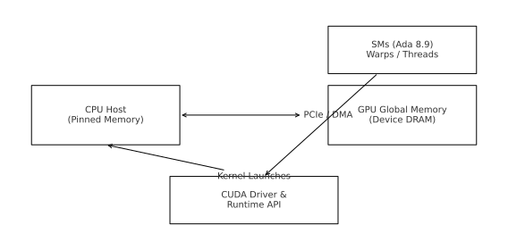
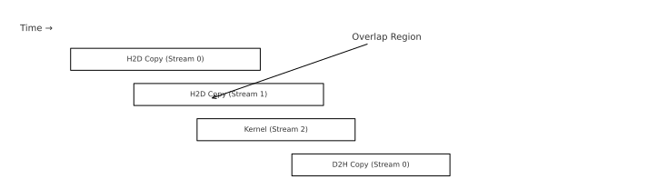

# DeepVision-RTX Starter

This is an enhanced README combining:
- GitHub-friendly formatting  
- Technical deep dive  
- ASCII diagrams  
- Rendered PNG diagrams  
- Profiling workflow  
- Architecture explanations  
- GPU hardware reasoning  

## Architecture Diagram (SVG)


## Streams Overlap Diagram (SVG)


## ASCII Architecture Diagram
```
   +-------------------+      PCIe / DMA      +---------------------+
   |      CPU Host     |  ----------------->  |     GPU Global      |
   |  (Pinned Memory)  |  <-----------------  |      Memory         |
   +-------------------+                      +---------------------+
            |                                           |
            | Launch Kernels                            |
            v                                           v
      +--------------+                          +------------------+
      | CUDA Driver  |                          |  SMs (Ada 8.9)   |
      | Runtime API  |                          |  Warps / Threads |
      +--------------+                          +------------------+
```

## ASCII Streams Overlap Diagram
```
Time →
----------------------------------------------------------------------
H2D Stream 0: [========== copy =========]
H2D Stream 1:         [========== copy =========]
Compute Stream 2:             [==== kernel ====]
D2H Stream 0:                           [==== copy ====]
----------------------------------------------------------------------
```

## Build Instructions
```bash
cmake -S . -B build -DCMAKE_BUILD_TYPE=Release
cmake --build build -j
./build/deepvision_rtx
```

## Profiling Instructions (Nsight Systems & Nsight Compute)
```bash
nsys profile -o nsys_report ./build/deepvision_rtx
ncu --set full ./build/deepvision_rtx
```

## Project Structure
```
src/
   main.cpp            # Entry point
   main.cu             # Separate experimental demo
   conv_kernels.cu     # SAXPY + blur3x3 kernels
   conv_kernels.cuh    # Kernel declarations
   utils/
       check_cuda.hpp  # Error-checking utilities
```

## GPU Architecture Notes (RTX 4070 SUPER - Ada 8.9)
- SM count: 46  
- Warp size: 32  
- Max threads/block: 1024  
- Memory bandwidth: 504 GB/s  
- Concurrent copy/compute supported  
- Best performance achieved when:
  - You use pinned memory  
  - H2D and D2H overlap with compute  
  - Kernels maintain good occupancy  

## Roadmap Aligned to NVIDIA Developer Tech Expectations
- Add shared-memory tiled blur  
- Add constant-memory kernel variants  
- Add half-precision path (FP16)  
- Add Tensor Core WMMA version  
- Add occupancy analysis + roofline plot  
- Add Nsight Compute performance tables  
- Add multi-kernel pipelines  
- Compare against cuDNN for 3×3 conv  

---
